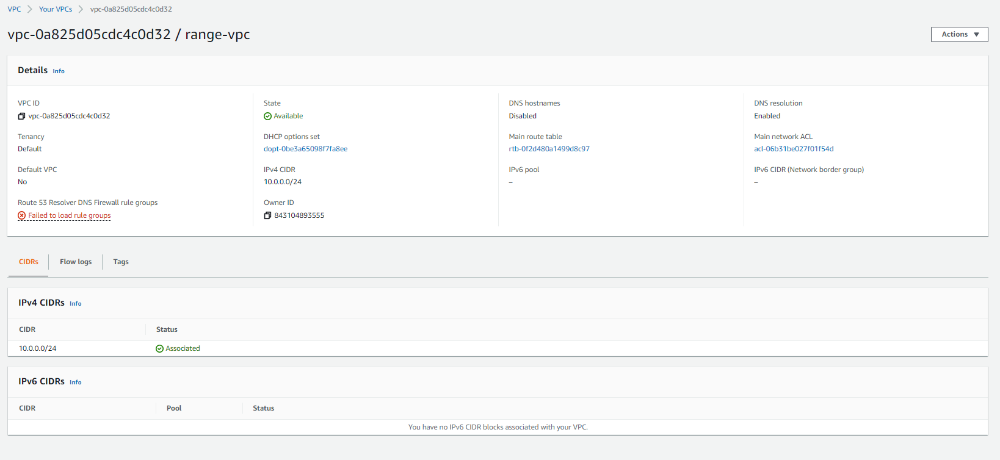
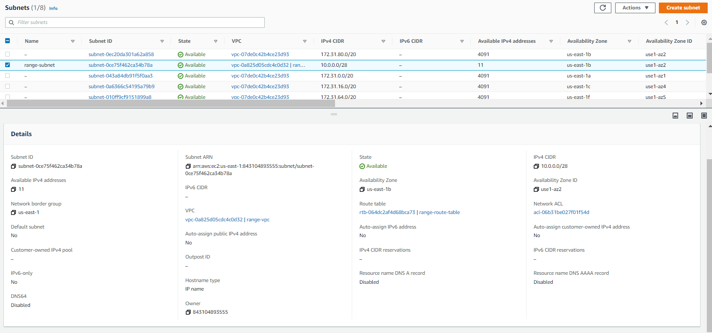
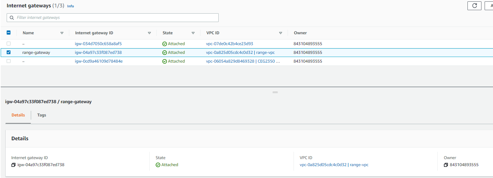
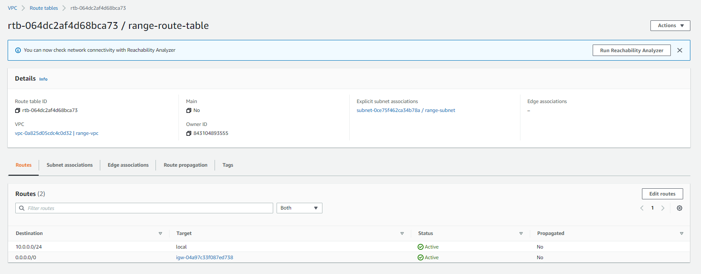
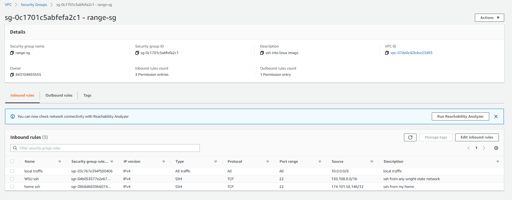

## Part 1

Question 1
A private amazon brand cloud

Question 2
A way to divide up networks into a butch of different networks still under the same network (web server for anyone, and a private git repo subnets)

Question 3
The door to the outside of connections

Question 4
Details about how you want traffic to move around

Question 5
A network level firewall

## Part 2

# 1.
* Debian 10
* admin
* t2.micro

# 2. 
* I added the security group that was linked to my vpc, and that pulled in everything the vpc had linked to it

