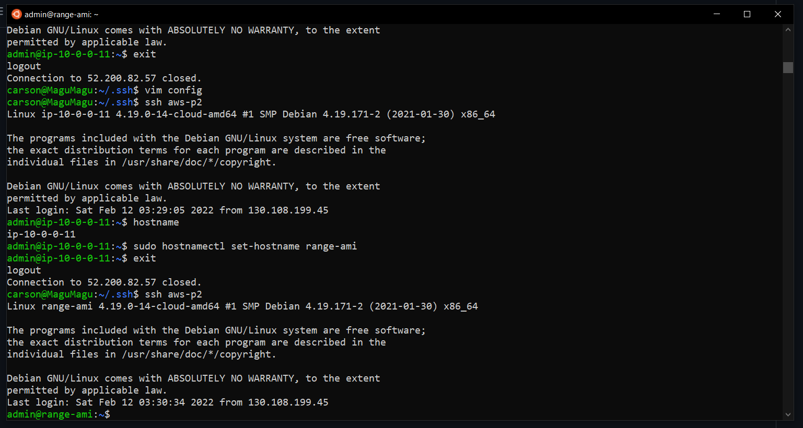

## Part 1

Question 1
A private amazon brand cloud


Question 2
A way to divide up networks into a butch of different networks still under the same network (web server for anyone, and a private git repo subnets)


Question 3
The door to the outside of connections


Question 4
Details about how you want traffic to move around


Question 5
A network level firewall


## Part 2

1.
* Debian 10
* admin
* t2.micro


2. You have to assign it at creation, once its created you can not change it. The way you do it is a manual creation of the instance, don't use the wizard.

3. It's not auto assigned because an public ip address costs money because they could sell it to someone else

4. I searched "volume" and clicked the ec2 option, and gave it 16gigs and named it "range-volume", and on actions I added it to my current instance via the drop down menu.

5. Hover over the name area, and a little box comes up, just click on that and a "edit name" prop comes up.

6. I went to details page and went to actions and hovered over secuity -> add secuity group -> range-sg

7. search "Elastic IP" and allocate a new one and then I went to actions and did "Associate" and added my instance to it

8.


9.
```
ssh -i ~/.ssh/keys/ceg3120-project2-1.pem admin@52.200.82.57
sudo hostnamectl set-hostname range-ami
```
(you have to relog for the new hostname to take affect)

10.



